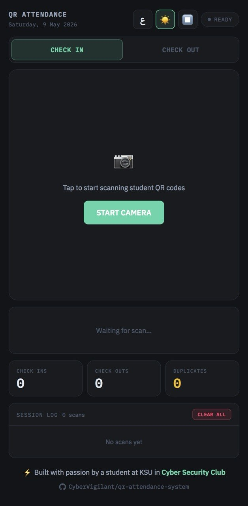
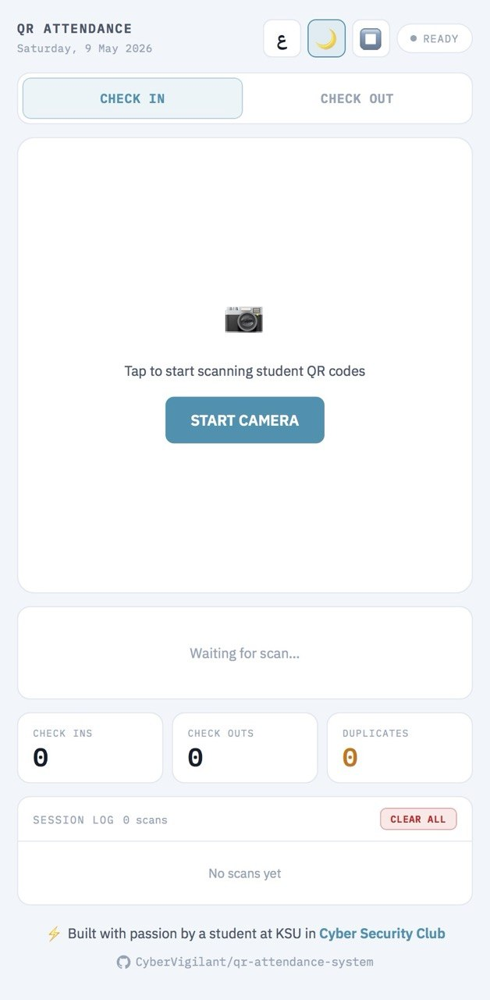
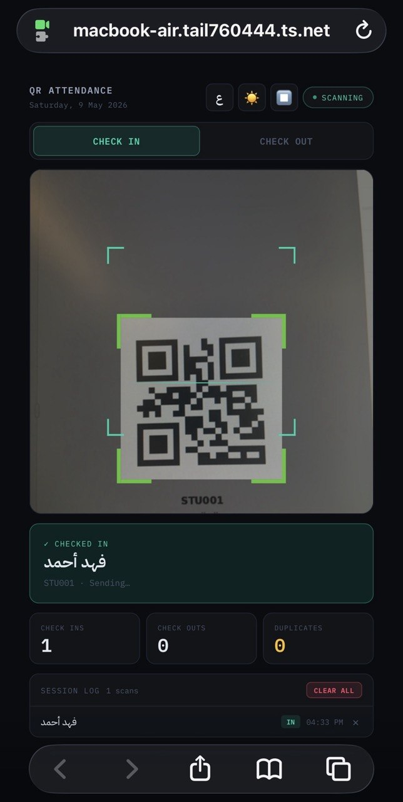
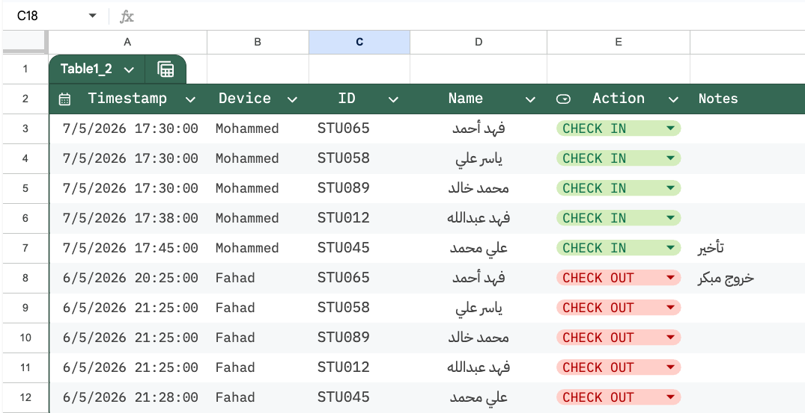

# QR Attendance System

A lightweight, secure QR-based attendance system built for programs with 10–200+ participants. Replaces slow manual name lookup with instant QR scanning — each student scans in under 2 seconds.

**Built with:** HTML + vanilla JS · Python · Google Apps Script · Google Sheets · Tailscale

---

## Features

- 📷 **Continuous QR scanning** — camera stays open, auto-resets after each scan in under 2 seconds
- ✅ **Check In / Check Out** — fills the same row, no duplicate rows
- ⚠️ **Duplicate detection** — frontend + backend both block double-scanning
- 🔒 **Private by design** — scanner only accessible via Tailscale VPN
- 🔑 **Token authentication** — secret token stored server-side, never in the browser
- 📋 **Audit log** — every scan recorded with device name and timestamp
- 🤖 **Telegram bot** — monitor and restart the server remotely
- 🔁 **Self-healing** — watchdog script auto-restarts anything that breaks
- 🌙 **Dark / Light mode** — with Arabic font support
- 📱 **Works on any phone** — no app install needed, just a browser

---

## Screenshots

<table>
  <tr>
    <td align="center"><b>Dark Mode</b></td>
    <td align="center"><b>Light Mode</b></td>
  </tr>
  <tr>
    <td></td>
    <td></td>
  </tr>
  <tr>
    <td align="center"><b>Live Scanning</b></td>
    <td align="center"><b>Google Sheet — Real Time</b></td>
  </tr>
  <tr>
    <td></td>
    <td></td>
  </tr>
</table>

> ⚡ From QR scan to Google Sheet update — **under 2 seconds**

---

## Architecture

```
Staff Phone (Tailscale VPN)
        │
        │  HTTPS (Tailscale Serve)
        ▼
Raspberry Pi / Mac (Python server)
  ├── Serves scanner.html
  └── /scan endpoint
        │  adds secret token
        ▼
Google Apps Script
  ├── Validates token
  ├── Rate limits (30 req/min)
  ├── Duplicate check
  └── Writes to Google Sheets
        ├── Attendance tab
        └── Audit tab
```

> **Note:** The watchdog script and Telegram bot are **optional**.
> The core system (scanner + Python server + Apps Script + Google Sheets) works
> fully without them. The watchdog adds self-healing reliability and the Telegram
> bot adds remote monitoring — both recommended for unattended deployments like
> a Raspberry Pi running 24/7, but not required for basic use on a Mac or PC.

---

## Security Layers

| Layer | What it protects against |
|---|---|
| Tailscale VPN | File unreachable from public internet |
| Secret token | Apps Script URL useless without it |
| Token on server only | Token never visible in browser DevTools |
| Rate limiting | Flood/DDoS attacks |
| Duplicate check | Fake double attendance |
| Audit log | Insider misuse — every action traced |

---

## Requirements

- Python 3.8+
- `pip install requests qrcode pillow`
- A Google account
- A Tailscale account (free tier is enough)
- Any of the following as your server:
  - **Raspberry Pi 4B** *(recommended — runs 24/7, low power)*
  - macOS (tested on MacBook Air)
  - Windows (WSL or native Python)
  - Any Linux machine

---

## Setup Guide

### Step 1 — Google Sheet

Create a Google Sheet with two tabs:

**Attendance tab** (columns):
```
A: Date | B: Time In | C: ID | D: Name | E: IN | F: OUT | G: Time Out
```

**Audit tab** (columns):
```
A: Timestamp | B: Device | C: ID | D: Name | E: Action
```

Copy your Sheet ID from the URL:
```
https://docs.google.com/spreadsheets/d/YOUR_SHEET_ID_HERE/edit
```

---

### Step 2 — Google Apps Script

1. In your Sheet → **Extensions → Apps Script**
2. Delete existing code → paste contents of `apps_script.js`
3. Replace `YOUR_GOOGLE_SHEET_ID_HERE` with your Sheet ID
4. Generate a secret token:
   ```bash
   openssl rand -hex 32
   ```
5. Replace `YOUR_SECRET_TOKEN_HERE` with your token
6. Set `TIMEZONE` to your timezone (e.g. `"Asia/Riyadh"`)
7. Save → **Deploy → New deployment**
   - Type: **Web App**
   - Execute as: **Me**
   - Who has access: **Anyone**
8. Copy the Web App URL

---

### Step 3 — Python Server

1. Clone this repo:
   ```bash
   git clone https://github.com/YOUR_USERNAME/qr-attendance-system.git
   cd qr-attendance-system
   ```

2. Install dependencies:
   ```bash
   pip3 install requests
   ```

3. Edit `server.py`:
   ```python
   GOOGLE_APPS_SCRIPT_URL = "YOUR_WEB_APP_URL"
   SECRET_TOKEN           = "YOUR_SECRET_TOKEN"  # same as in apps_script.js
   ```

4. Run:
   ```bash
   python3 server.py
   ```

---

### Step 4 — Tailscale (HTTPS)

1. Install Tailscale on your server machine and all staff phones
2. On the server, enable HTTPS Serve:
   ```bash
   sudo tailscale serve --bg http://localhost:8080
   ```
3. Your scanner is now live at:
   ```
   https://<your-device>.tail<id>.ts.net/scanner.html
   ```
   Only devices connected to your Tailscale network can access it.

---

### Step 5 — Scanner App

Edit `scanner.html`:
```javascript
const STUDENTS = {
  "STU001": "Full Name",
  "STU002": "Full Name",
  // ...
};
```

The file is served automatically by `server.py` — no separate hosting needed.

---

### Step 6 — Generate QR Codes

1. Install:
   ```bash
   pip3 install qrcode pillow
   ```

2. Edit `generate_qr.py` with your student list:
   ```python
   STUDENTS = [
     ("STU001", "Full Name"),
     ("STU002", "Full Name"),
   ]
   ```

3. Run:
   ```bash
   python3 generate_qr.py
   ```
   QR codes are saved to `qrcodes/` — one PNG per student, named by ID.

> ⚠️ **QR codes are excluded from git** (see `.gitignore`) because they contain student IDs. Send them privately to each student.

---

### Step 7 — Auto-start on Boot (Raspberry Pi)

1. Copy scripts:
   ```bash
   chmod +x watchdog.sh
   ```

2. Edit paths in `watchdog.sh` to match your setup

3. Add to crontab:
   ```bash
   crontab -e
   ```
   ```
   @reboot sleep 15 && sudo tailscale serve --bg http://localhost:8080 && python3 /path/to/server.py &
   * * * * * bash /path/to/watchdog.sh
   ```

---

### Step 8 — Telegram Bot (optional)

1. Create a bot via **@BotFather** in Telegram → get your token
2. Get your chat ID via **@userinfobot**
3. Edit `telegram_bot.py`:
   ```python
   BOT_TOKEN = "YOUR_BOT_TOKEN"
   CHAT_ID   = "YOUR_CHAT_ID"
   LOG_FILE  = "/path/to/watchdog.log"
   ```
4. Run:
   ```bash
   python3 telegram_bot.py &
   ```

**Commands:**
- `/status` — full server health check
- `/log` — last 20 watchdog log lines
- `/restart` — restart Python server
- `/reboot` — reboot the Pi

---

## File Structure

```
qr-attendance-system/
├── scanner.html       # Staff-facing scanner web app
├── server.py          # Python backend (add your secrets here)
├── apps_script.js     # Google Apps Script code
├── generate_qr.py     # QR code generator
├── watchdog.sh        # Self-healing watchdog
├── telegram_bot.py    # Telegram monitor bot
├── .gitignore         # Excludes secrets, QR codes, logs
└── README.md
```

---

## Important Security Notes

> **Never commit secrets to git.**

The following must be kept private and configured locally:
- `GOOGLE_APPS_SCRIPT_URL` — paste into `server.py` only
- `SECRET_TOKEN` — paste into both `server.py` and `apps_script.js`
- `BOT_TOKEN` + `CHAT_ID` — paste into `telegram_bot.py` only
- `qrcodes/` folder — send QR images privately to each student

If you accidentally commit a secret:
1. Rotate it immediately (generate a new token, redeploy Apps Script)
2. Revoke the old one
3. Use `git filter-repo` to remove it from history

---

## How It Works (Flow)

```
Student shows QR code
        ↓
Staff scans with phone camera
        ↓
Scanner shows: ✅ Student Name — Checked In
        ↓
Phone sends: student ID + type + device name
  (no token, no Google URL)
        ↓
Python server adds secret token
        ↓
Google Apps Script validates + rate limits + checks duplicates
        ↓
Attendance sheet updated
Audit log entry added
```

---

## Customisation

| What | Where |
|---|---|
| Student list | `scanner.html` → `const STUDENTS` |
| Program name in header | `scanner.html` → `.brand` div |
| Timezone | `apps_script.js` → `TIMEZONE` |
| Rate limit | `apps_script.js` → `count > 30` |
| Watchdog frequency | crontab → `* * * * *` |
| Audit log path | `watchdog.sh` + `telegram_bot.py` |

---

## License

MIT — free to use, modify, and distribute.

---

## Deploying for a New Program

Only two files need updating between deployments:

| File | What to update |
|---|---|
| `scanner.html` | `STUDENTS` object — add your student list |
| `server.py` | `GOOGLE_APPS_SCRIPT_URL` + `SECRET_TOKEN` |

Everything else — watchdog, Telegram bot, Apps Script, QR generator — stays unchanged.

---

## Author

Built and deployed in a real program environment as part of a cybersecurity initiative.

- 🐙 GitHub: [@CyberVigilant](https://github.com/CyberVigilant)
- 💼 LinkedIn: [linkedin.com/in/saleh-almahmoud](https://www.linkedin.com/in/saleh-almahmoud-b666302ab)

---

## Contributing

Pull requests welcome. Please do not commit any real student data, tokens, or personal information in examples or tests.
